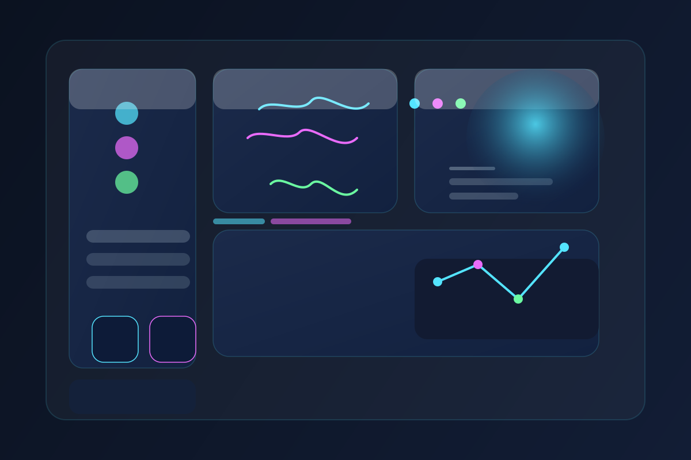
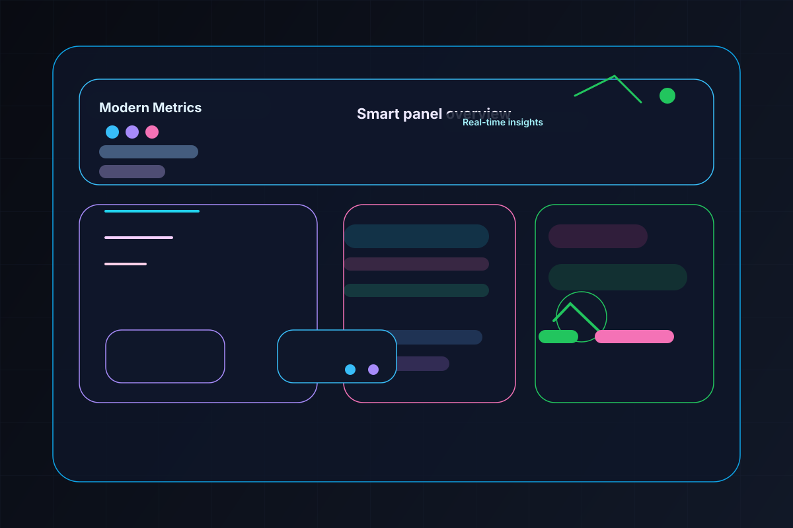
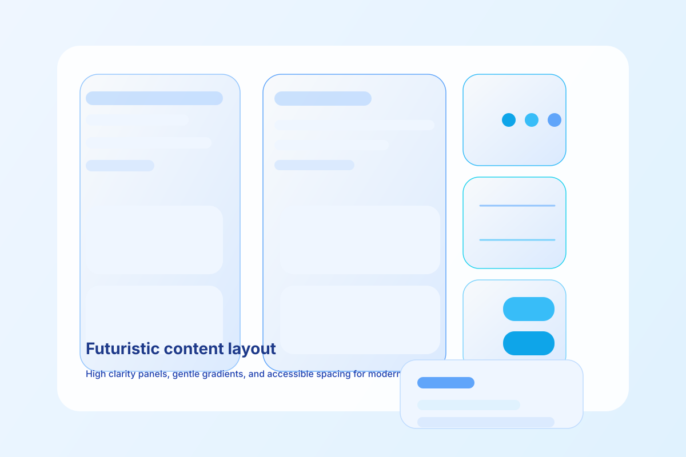

# UI Component Architecture Proposal

## Context

- **Target framework**: React 18 with Next.js 14 App Router
- **Styling system**: Tailwind CSS v3.4 in the current app
- **Existing component library**: Minimal atom primitives present in `src/components/ui/` such as `Button.tsx`, `Input.tsx`, `Badge.tsx`, plus `Card.tsx` and `Table.tsx`
- **Design token source**: None currently authored; needs a central token module with semantic aliases and theme values
- **Theming requirements**: Light/dark mode support, runtime theme switching, CSS variable export for cross-component consistency

## Component Plan

- [ ] **UI-PLAN-1.1 [Design Token System]**:
  - **Atomic Level**: Foundation
  - **Variants**: Light theme, Dark theme, Semantic alias scales
  - **Props**: token exports only (`colors`, `typography`, `spacing`, `shadows`, `radii`, `breakpoints`)
  - **Dependencies**: Theme provider, Tailwind config integration

- [ ] **UI-PLAN-1.2 [Button]**:
  - **Atomic Level**: Atom
  - **Variants**: `primary`, `secondary`, `ghost`, `danger`, `success`, `outline`
  - **Props**: `variant`, `size`, `loading`, `disabled`, `fullWidth`, `as`, `icon`, `children`
  - **Dependencies**: design tokens, Spinner

- [ ] **UI-PLAN-1.3 [Input]**:
  - **Atomic Level**: Atom
  - **Variants**: `text`, `email`, `password`, `number`
  - **Props**: `label`, `error`, `helperText`, `id`, `name`, `type`, `required`, `onChange`
  - **Dependencies**: design tokens, Form field layout primitive

- [ ] **UI-PLAN-1.4 [Typography]**:
  - **Atomic Level**: Atom
  - **Variants**: `Heading`, `Text`, `Label`, `Caption`
  - **Props**: `size`, `weight`, `as`, `className`, `children`
  - **Dependencies**: design tokens

- [ ] **UI-PLAN-1.5 [Badge / Tag]**:
  - **Atomic Level**: Atom
  - **Variants**: `primary`, `secondary`, `accent`, `danger`, `success`, `neutral`
  - **Props**: `variant`, `size`, `children`
  - **Dependencies**: design tokens

- [ ] **UI-PLAN-1.6 [Icon]**:
  - **Atomic Level**: Atom
  - **Variants**: size-only wrapper with accessible label support
  - **Props**: `name`, `size`, `ariaLabel`, `color`, `className`
  - **Dependencies**: lucide-react or icon set

- [ ] **UI-PLAN-1.7 [Card]**:
  - **Atomic Level**: Molecule
  - **Variants**: `default`, `elevated`, `bordered`, `ghost`
  - **Props**: `title`, `subtitle`, `footer`, `children`
  - **Dependencies**: Typography, Badge

- [ ] **UI-PLAN-1.8 [Table]**:
  - **Atomic Level**: Molecule/Organism
  - **Variants**: simple table, sortable table, responsive table
  - **Props**: `columns`, `data`, `rowKey`, `caption`, `emptyState`
  - **Dependencies**: Typography, Badge, Button

- [ ] **UI-PLAN-1.9 [Dialog]**:
  - **Atomic Level**: Organism
  - **Variants**: modal, confirmation, form dialog
  - **Props**: `open`, `onOpenChange`, `title`, `description`, `children`, `trigger`, `closeOnEsc`
  - **Dependencies**: Focus trap, overlay, Button

- [ ] **UI-PLAN-1.10 [Toast / Alert]**:
  - **Atomic Level**: Organism
  - **Variants**: `success`, `error`, `warning`, `info`
  - **Props**: `message`, `title`, `variant`, `duration`, `onClose`
  - **Dependencies**: Icon, Button, animation utility

- [ ] **UI-PLAN-1.11 [Theme Provider]**:
  - **Atomic Level**: Foundation
  - **Variants**: `light`, `dark`, `custom`
  - **Props**: `defaultTheme`, `disableTransitionOnChange`, `children`
  - **Dependencies**: design tokens, CSS custom property injection

- [ ] **UI-PLAN-1.12 [Layout primitives]**:
  - **Atomic Level**: Atoms/Molecules
  - **Components**: `Stack`, `Grid`, `Container`, `Divider`, `Spacer`
  - **Props**: spacing, alignment, responsive columns
  - **Dependencies**: design tokens

- [ ] **UI-PLAN-1.13 [Responsive hook]**:
  - **Atomic Level**: Hook
  - **Exports**: `useBreakpoint`, `useMediaQuery`
  - **Dependencies**: browser API, SSR-safe guard

## Component Items

- [ ] **UI-ITEM-1.1 [Button Implementation]**:
  - **API**: `ButtonProps` with `variant`, `size`, `loading`, `as`, `fullWidth`
  - **Accessibility**: `aria-busy`, `aria-disabled`, keyboard focus ring, disabled button semantics
  - **Stories**: Primary, secondary, ghost, destructive, loading, disabled, as-anchor example
  - **Tests**: click behavior, loading state, disabled prevention, keyboard focus, snapshot

- [ ] **UI-ITEM-1.2 [Input Implementation]**:
  - **API**: `InputProps` including `label`, `helperText`, `error`, `type`
  - **Accessibility**: label association, `aria-invalid`, `aria-describedby`, focus outline
  - **Stories**: default, error, helper text, password, number, controlled value
  - **Tests**: typed input, error message rendering, helper text association, SSR render

- [ ] **UI-ITEM-1.3 [Badge / Tag Implementation]**:
  - **API**: `BadgeProps` with semantic variants and size
  - **Accessibility**: role `status` optional, color contrast compliant backgrounds
  - **Stories**: all semantic variants, inline usage, pill style
  - **Tests**: variant class application, accessibility text, snapshot

- [ ] **UI-ITEM-1.4 [Typography System]**:
  - **API**: `HeadingProps`, `TextProps`, `LabelProps`, `CaptionProps`
  - **Accessibility**: semantic element mapping and readable scaling
  - **Stories**: heading scale, body text, label + helper patterns
  - **Tests**: correct DOM element rendering, class composition

- [ ] **UI-ITEM-1.5 [Card Implementation]**:
  - **API**: `Card`, `CardContent`, `CardHeader`, `CardFooter`
  - **Accessibility**: keyboard-safe interactive card actions
  - **Stories**: info card, profile card, CTA card, borderless card
  - **Tests**: slot rendering, class names, responsive layout

- [ ] **UI-ITEM-1.6 [Table Implementation]**:
  - **API**: `Table`, `TableHeader`, `TableBody`, `TableRow`, `TableCell`
  - **Accessibility**: `<table>` semantics, `scope`, responsive text wrapping
  - **Stories**: row data, empty state, sortable table, mobile-friendly table
  - **Tests**: data rendering, header association, empty fallback

- [ ] **UI-ITEM-1.7 [Dialog Implementation]**:
  - **API**: controlled `open`, `onOpenChange`, render trigger, focus trap
  - **Accessibility**: `role="dialog"`, `aria-modal`, keyboard Esc close, focus return
  - **Stories**: confirmation modal, form modal, nested dialog
  - **Tests**: open/close flow, focus trap, escape key handling, ARIA attributes

- [ ] **UI-ITEM-1.8 [Toast / Alert Implementation]**:
  - **API**: queueing toast provider, `Alert` with `variant`
  - **Accessibility**: live region announcements, dismiss buttons, timeout pause on hover
  - **Stories**: success toast, error alert, dismissible message
  - **Tests**: toast lifecycle, auto-dismiss, screen reader text

- [ ] **UI-ITEM-1.9 [Theme Provider Implementation]**:
  - **API**: `ThemeProvider` with context and CSS variable injection
  - **Accessibility**: ensure contrast tokens meet WCAG
  - **Stories**: light/dark theme toggle, custom theme override
  - **Tests**: theme switching, SSR hydration safe, CSS variable presence

- [ ] **UI-ITEM-1.10 [Layout Primitives Implementation]**:
  - **API**: `Stack`, `Grid`, `Container`, `Divider`, `Spacer`
  - **Accessibility**: semantic container usage, spacing via tokens
  - **Stories**: stacked forms, grid gallery, responsive layout
  - **Tests**: spacing props, responsive column behavior

## Proposed Code Changes

### Design token source
Create a token file that can drive both Tailwind and the React component library.

```ts
// src/tokens/design-tokens.ts
export const tokens = {
  colors: {
    action: {
      primary: "#1d4ed8",
      secondary: "#059669",
      accent: "#d97706",
      danger: "#dc2626",
      success: "#16a34a",
    },
    neutral: {
      100: "#f8fafc",
      200: "#e2e8f0",
      300: "#cbd5e1",
      400: "#94a3b8",
      500: "#64748b",
      600: "#475569",
      700: "#334155",
      800: "#1e293b",
      900: "#0f172a",
    },
  },
  typography: {
    fontFamily: {
      sans: "Inter, ui-sans-serif, system-ui, sans-serif",
      mono: "ui-monospace, SFMono-Regular, Menlo, Monaco, Consolas, 'Liberation Mono', 'Courier New', monospace",
    },
    sizes: {
      xs: "0.75rem",
      sm: "0.875rem",
      md: "1rem",
      lg: "1.125rem",
      xl: "1.25rem",
      "2xl": "1.5rem",
      "3xl": "1.875rem",
      "4xl": "2.25rem",
    },
    weights: {
      regular: 400,
      medium: 500,
      semibold: 600,
      bold: 700,
    },
  },
  spacing: {
    xs: "0.25rem",
    sm: "0.5rem",
    md: "1rem",
    lg: "1.5rem",
    xl: "2rem",
    "2xl": "3rem",
  },
  radii: {
    sm: "0.375rem",
    md: "0.75rem",
    lg: "1rem",
    round: "9999px",
  },
  shadows: {
    sm: "0 1px 2px rgba(15, 23, 42, 0.05)",
    md: "0 4px 12px rgba(15, 23, 42, 0.08)",
    lg: "0 10px 30px rgba(15, 23, 42, 0.12)",
  },
  breakpoints: {
    sm: "640px",
    md: "768px",
    lg: "1024px",
    xl: "1280px",
  },
};
```

### Button API proposal

```ts
interface ButtonProps extends React.ButtonHTMLAttributes<HTMLButtonElement> {
  variant?: "primary" | "secondary" | "ghost" | "danger" | "success" | "outline";
  size?: "sm" | "md" | "lg";
  loading?: boolean;
  fullWidth?: boolean;
  as?: React.ElementType;
  icon?: React.ReactNode;
}
```

### Input API proposal

```ts
interface InputProps extends React.InputHTMLAttributes<HTMLInputElement> {
  label?: string;
  helperText?: string;
  error?: string;
  id?: string;
}
```

### Theme provider skeleton

```tsx
// src/components/ui/ThemeProvider.tsx
import React from "react";
import { tokens } from "../../tokens/design-tokens";

export type ThemeMode = "light" | "dark";

export interface ThemeProviderProps {
  defaultTheme?: ThemeMode;
  children: React.ReactNode;
}

export const ThemeProvider: React.FC<ThemeProviderProps> = ({ defaultTheme = "light", children }) => {
  // inject CSS vars and context here
  return <div data-theme={defaultTheme}>{children}</div>;
};
```

### Tailwind integration suggestion
Add semantic aliases to `tailwind.config.ts` based on the same token scales to keep utility classes aligned with component theme values.

## Commands

- `npm install`
- `npx tsc --noEmit`
- `npm run dev`
- `npm run build`
- `npm run lint`
- `npx sb init` (proposed Storybook bootstrap)
- `npm run storybook` (after Storybook is configured)

## Style Options and Image Designs

### Design Option 1: Neon Grid Analytics
- High-end dark theme with glassmorphism panels
- Futuristic neon accents in cyan, violet, and electric green
- Structured dashboard grid with strong information hierarchy
- Emphasizes data cards, quick stats, and timeline charts



### Design Option 2: Holographic Control Room
- Deep charcoal base with luminous gradient outlines
- Modular card clusters for real-time system monitoring
- Crisp typography with minimal input controls
- Ideal for a tech operations or EMS command center aesthetic



### Design Option 3: Soft Futurism Experience
- Light modern theme with cool blue gradients
- Spacious, accessible panels and calm interface zones
- High contrast action buttons and clear navigation paths
- Best for executive dashboards and user-friendly admin portals



## Quality Assurance Task Checklist

- [ ] Component APIs are consistent with existing library conventions
- [ ] All components pass axe accessibility checks with zero violations
- [ ] TypeScript compiles without errors and provides accurate autocompletion
- [ ] Storybook builds successfully with all stories rendering correctly
- [ ] Unit tests pass and cover logic, interactions, and edge cases
- [ ] Bundle size impact is measured and within acceptable limits
- [ ] SSR/SSG rendering produces no hydration warnings or errors
